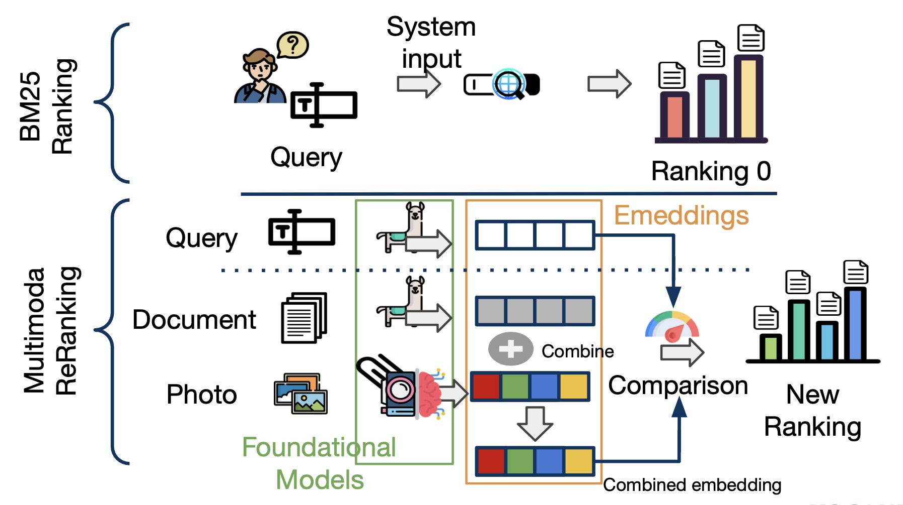

# CS293S
Project repo for enhancing text search by using multimodal information

## Steps:
1. Preprocess MS-Marco dataset. Find out if this dataset has images. Otherwise use the different dataset that we found.
    - Parse the url for images using beautiful soup.
    - One time offline step.
    - statistics for number of images per document.
2. Use BM25 to get the top N documents for each query.
3. Embed the text of the documents and query using a Text Encoder ( maybe BERT or something else)
4. Embed the query and images in the documents using a Vision-Text Encoder (OpenClip or OpenFlamingo)
5. Use both the embeddings to train a model to rank the documents for each query.
OR
5. Use both the embeddings to directly compute a cosine score and compute a joint rank.
6. Evaluate the model on the MS-Marco Dataset.

## Comparisons:
1. Using image captions as part of the text.
2. Using image captions in place of image embeddings in above pipeline.
3. 

# Project Documentation

This project involves ranking and evaluating documents based on text and image scores. The project consists of several Python scripts and a shell script that runs these scripts in sequence.

## Scripts

1. `textRanking.py`: This script ranks documents based on text scores. It takes as input a JSON file containing queries and outputs a JSON file with the text scores.

2. `evaluate.py`: This script evaluates the rankings. It takes as input a JSON file containing queries and a JSON Lines file containing the rankings.

3. `multimodalRanking.py`: This script ranks documents based on both text and image scores. It takes as input two JSON files containing the text and image scores, respectively.

4. `rerank.sh`: This shell script runs the above scripts in sequence. It assumes that the input data is located in the `./data/wikiweb2m/` directory.

## Usage

To run the scripts, use the following command:

This will execute the scripts in sequence with the default input data.

## Input Data

The input data should be in the following format:

- `image_scores.json`: A JSON file containing the image scores for the queries.
- `ranking_bm25_full.jsonl`: A JSON Lines file containing the BM25 rankings for the queries.
- `text_scores.json`: A JSON file containing the text scores for the queries.

## Output Data

The scripts output the following data:

- `text_scores.json`: A JSON file containing the text scores for the queries, output by `textRanking.py`.
- `text_scores_image_True_text_True_scores.json`: A JSON file containing the multimodal scores for the queries, output by `multimodalRanking.py`.

